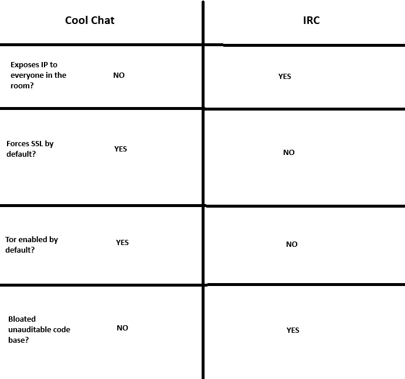

# coolchat
A retro inspired chat software

## About
Cool chat is a retro inspired chat software that was created to demonstrate just how much better things could be compared to IRC, 
It's goal is to eventually serve as a replacement to the outdated and unsecure IRC protocol.
It is not designed to function like Dicord or XMPP. there is no store and forwarding of messages, chats happen in real time. 

## Server usage
Generate a cert for first time use
> ./chatserver gencert

Run the server
> ./chatserver ip port

## Client usage
* Find a server in the client/serverlist.csv file
* Choose if you want to connect over Tor. (Requires a running instance of the Tor daemon or the TBB)
* Once connected you will be prompted for a username, enter it and begin chatting.

## Updating the server list
Eventually there will be a much nicer way to do this and find servers but until then just make a pull request to this repo if you have a server you want added.

