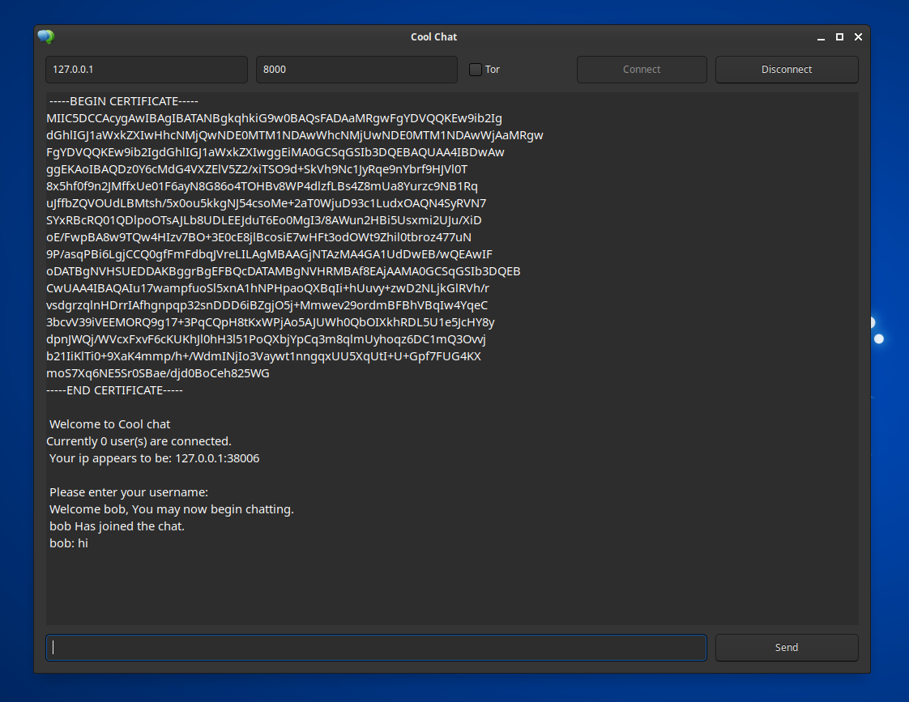

# coolchat
A retro inspired chat software

## Server usage
> ./chatserver <ip> <port>

## Client usage
* Find a server in the client/serverlist.csv file
* Choose if you want to connect over Tor. (Requires a running instance of the Tor daemon or the TBB)
* Once connected you will be prompted for a username, enter it and begin chatting.

